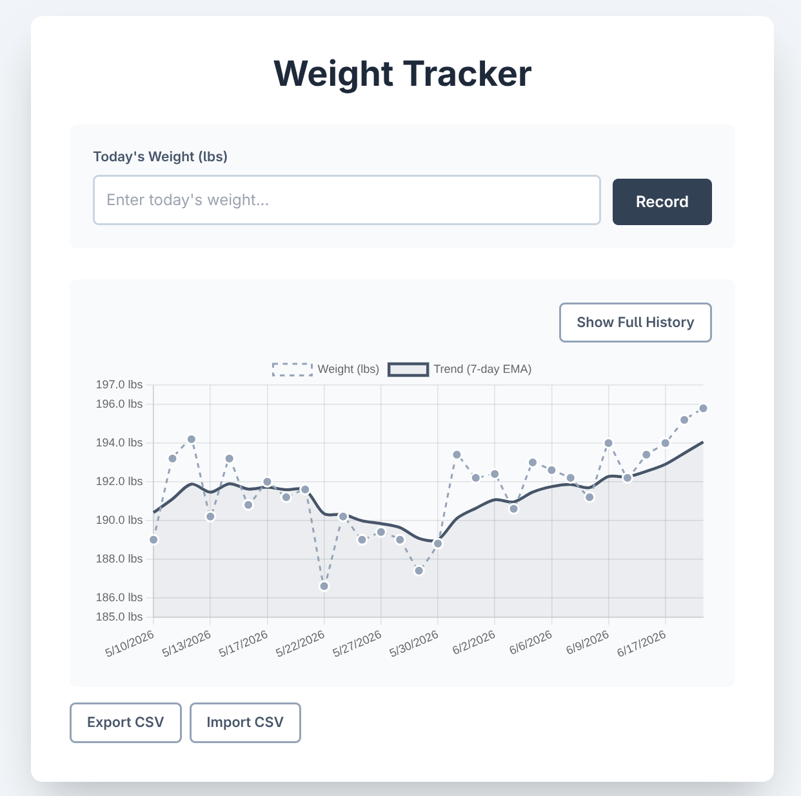

# Weight Tracker

A simple weight tracking app with a visualization showing daily weight and 7-day exponential moving average.

## Screenshot



## Features

- Record daily weight
- Weight history visualization
- Weight trend analysis with exponential moving average (EMA) smoothing
- Persistent SQLite database

## Running Locally

```bash
go run main.go
```

Visit `http://localhost:8080`

## Kubernetes
I use these manifests to deploy to my home k3s cluster:
```bash
kubectl apply -f k8s/manifest.yaml
```

## Test Data

Generate 50 days of semi-realistic test weight data:

```bash
python3 test/populate_weights.py
```

## Database

Weight data is stored in `weights.db` (SQLite). See `test/README.md` for test utilities.
